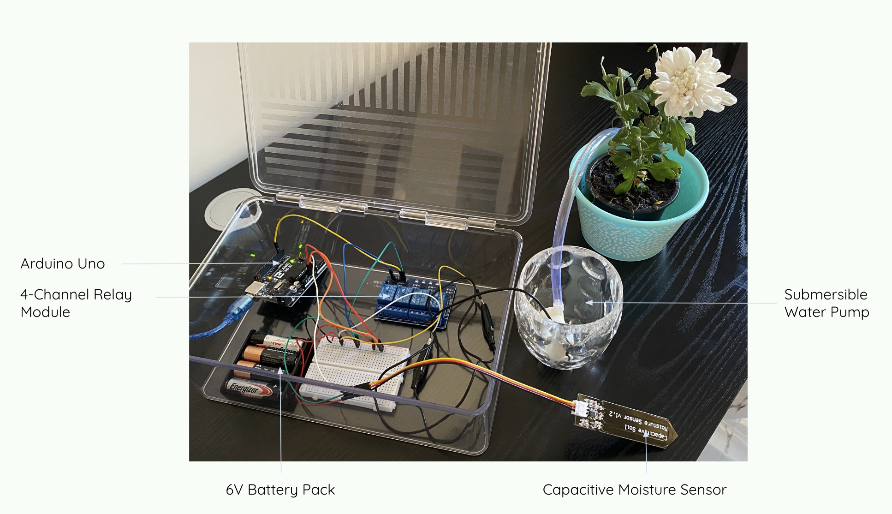

# Automatic Plant Watering System :seedling: 

## Description

This project is a system that checks the <b>moisture level</b> of the soil in a plant pot <b>every 24 hours</b>. If the moisture is <b>less than 50%</b> of the maximum moisture, then water is pumped into the pot for <b>.6 seconds</b>. I used a 4-channel relay module (a single could have also worked), an Arduino Uno, and a water pump as the key components.

## Visuals

[Automatic Plant Watering System In Action](https://www.youtube.com/watch?v=Uy4JWaQ_5t4)

